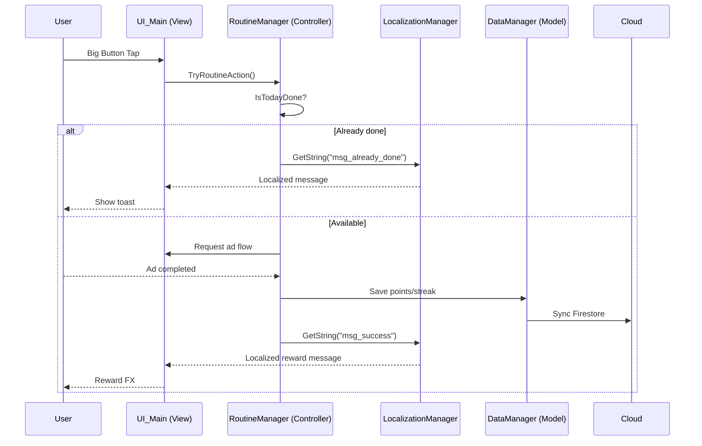

# System Architecture: Just One Tap

> **Pattern:** MCV (Manager-Controller-View)  
> **Updated:** 2026-02-19 (2차)

---

## 1. Core Loop (Runtime)



---

## 2. Runtime Components

### 2.1 Managers (Singleton)
- `GameManager`: 앱 상태 및 씬 전환 컨텍스트.
- `RoutineManager`: 1일 1회 로직, streak/point 규칙.
- `DataManager`: 로컬 저장 + Firestore 동기화.
- `LocalizationManager`: 언어 선택 및 문자열 조회.
- `AuthManager`: 사용자 식별/로그인 상태.

### 2.2 Views
- `UI_Onboarding`: 인트로, 목표 설정.
- `UI_Main`: 상단 상태, 중앙 버튼, 하단 네비.
- `UI_Settings`: 언어/알림/사운드.

---

## 3. Editor and Tooling Components

- `Assets/Editor/ProjectSetupTool.cs`
  - 폴더/기본 스크립트 자동 생성.
  - Player Settings 자동 적용.
- `Assets/Editor/PackageInstaller.cs`
  - 필수 패키지 설치 요청.
- `figma-plugin/export-all-svg/*`
  - Figma 전체 트리 SVG 추출 플러그인.
  - ZIP + `_manifest.json` + `_failed.json` 생성.
- `svg-inspector/*`
  - Unity 외부 검수 앱.
  - 화면(root SVG) 검수 + 상태 기록 + Unity 매니페스트 출력.

---

## 4. Figma Export Pipeline

1. Figma 플러그인 실행 (`Export All Nodes To SVG (Full Tree)`).
2. Scope 선택 (`selection`, `current-page`, `all-pages`).
3. 노드 재귀 수집 후 `exportAsync({ format: "SVG" })`.
4. 트리 구조 유지 ZIP 생성.
5. `_manifest.json`/`_failed.json`로 결과 검증.

최근 검증:
- `totalTargets`: 4104
- `exportedCount`: 3302
- `failedCount`: 802
- 주요 실패 원인: 보이는 레이어 없음(`This node may not have any visible layers.`)

---

## 5. SVG Inspection Pipeline (External Web App)

1. `svg-inspector` 실행 후 추출 루트(`Page 1/`) 선택.
2. 루트 하위 1-depth 폴더를 화면(Screen)으로 판정.
3. root SVG 규칙 적용:
   - 우선: `<screenName>__*.svg`
   - fallback: 화면 폴더 직속 첫 SVG
4. 화면별 검수 상태(`pending/approved/hold`) + 메모 기록.
5. `unity-inspection-manifest.json`으로 내보내 Unity 후속 자동화 입력으로 사용.

예외 처리:
- root SVG 누락/빈 폴더/파싱 실패는 `issues`로 기록하고 앱은 중단하지 않음.

---

## 6. Data Schemas

### 6.1 Runtime Save Schema (Game)

```json
{
  "uid": "user_global_001",
  "identity": {
    "nickname": "Player1",
    "country": "US",
    "language": "en"
  },
  "settings": {
    "dailyTarget": 5.0,
    "currencySymbol": "$"
  },
  "routine": {
    "currentPoints": 15.0,
    "currentStreak": 3,
    "lastActionDate": "2026-02-19"
  }
}
```

### 6.2 Unity Inspection Manifest Schema

```json
{
  "version": 1,
  "generatedAt": "2026-02-19T00:00:00.000Z",
  "sourceRoot": "Page 1",
  "summary": {
    "screenTotal": 0,
    "approved": 0,
    "hold": 0,
    "pending": 0,
    "svgTotal": 0
  },
  "screens": [
    {
      "id": "13-3321",
      "name": "Profile",
      "folderPath": "Profile",
      "rootSvgPath": "Profile/Profile__13-3321.svg",
      "svgCount": 0,
      "reviewStatus": "pending",
      "reviewNote": "",
      "issues": []
    }
  ],
  "files": [
    {
      "screenId": "13-3321",
      "relativePath": "Profile/Profile__13-3321.svg",
      "nodeId": "13:3321",
      "nodeName": "Profile"
    }
  ]
}
```
