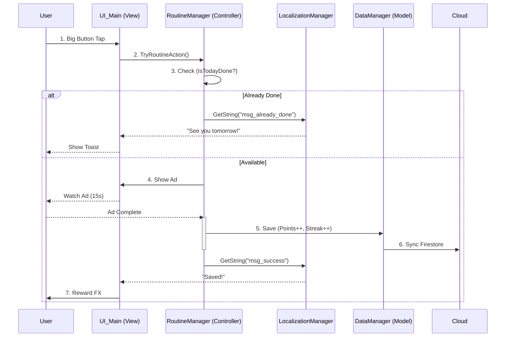

# 🏗️ System Architecture: Just One Tap

> **Pattern:** MCV (Manager-Controller-View)
> **Localization:** Multi-language Support Architecture

---

## 1. 🔄 Core Loop (Global Standard)



## 2. 🧩 Components

### 2.1. Managers (Singleton)
* **`GameManager`**: 앱 전반의 상태(State) 관리. `DontDestroyOnLoad` 적용, `GameState` enum (Intro, Main) 포함.
* **`DataManager`**: 로컬(JSON) 및 클라우드(Firestore) 데이터 동기화. `Save()`, `Load()` 메서드 제공.
* **`LocalizationManager`**:
    * 시스템 언어 감지 → 지원 언어(En/Ko) 자동 매칭.
    * 런타임 언어 변경 기능 (`SetLanguage(string langCode)`) 지원.
* **`RoutineManager`**: 핵심 루틴(One Tap) 및 스트릭(Streak) 로직 처리. `IsTodayDone()`, `TryRoutineAction()` 메서드 제공.
* **`AuthManager`**: 소셜 로그인 및 인증 관리. `Login()`, `Logout()` 메서드 제공.

### 2.2. Views (UI)
* **`UI_Onboarding`**: Intro 텍스트 애니메이션, 목표 설정 슬라이더.
* **`UI_Main`**: 메인 버튼(The Button), 상단 정보(국기, 포인트, 불꽃).
* **`UI_Settings`**: 언어 선택 드롭다운, 알림 및 사운드 토글.

### 2.3. Editor Tools
* **`ProjectSetupTool`** (`Assets/Editor/ProjectSetupTool.cs`):
    * 프로젝트 초기 설정을 위한 에디터 툴.
    * `Tools > J_O_T > Initialize Project` 메뉴로 실행 가능.
    * Tree.md 구조에 맞는 폴더 구조 자동 생성.
    * 5개 핵심 매니저 스크립트 템플릿 자동 생성.
    * `Tools > J_O_T > Apply Project Settings` 메뉴로 Player Settings 자동 적용 기능 제공.
    * Player Settings 자동 적용: Identity(Company, Product, Package, Version), Resolution(Portrait 고정), Android(MinSDK 24, IL2CPP, .NET Standard, ARM64+ARMv7), Accelerometer Frequency 60Hz.
* **`PackageInstaller`** (`Assets/Editor/PackageInstaller.cs`):
    * Unity 필수 패키지 설치 및 다국어 기초 데이터(JSON) 생성을 위한 에디터 툴.
    * `Tools > J_O_T > Install Packages & Data` 메뉴로 실행 가능.
    * Unity Package Manager를 통한 패키지 설치 요청 (`com.unity.vectorgraphics`, `com.unity.localization`).
    * `Assets/_Project/Resources/Localization` 폴더에 `en.json`, `ko.json` 파일 자동 생성.
    * 기존 파일 덮어쓰기 방지, UTF-8 인코딩 사용.

---

## 3. 💾 Data Schema

> **Format:** JSON (Firestore Document)

```json
{
  "uid": "user_global_001",
  "identity": {
    "nickname": "Player1",
    "country": "US",     // ISO 3166-1 alpha-2 code
    "language": "en"     // "en", "ko", "ja", etc.
  },
  "settings": {
    "dailyTarget": 5.0,    // 사용자 설정 목표 금액 (USD 기준)
    "currencySymbol": "$"  // 표시할 통화 기호
  },
  "routine": {
    "currentPoints": 15.0, // 누적 포인트
    "currentStreak": 3,    // 연속 달성일
    "lastActionDate": "2026-02-09" // 마지막 탭 날짜 (YYYY-MM-DD)
  }
}