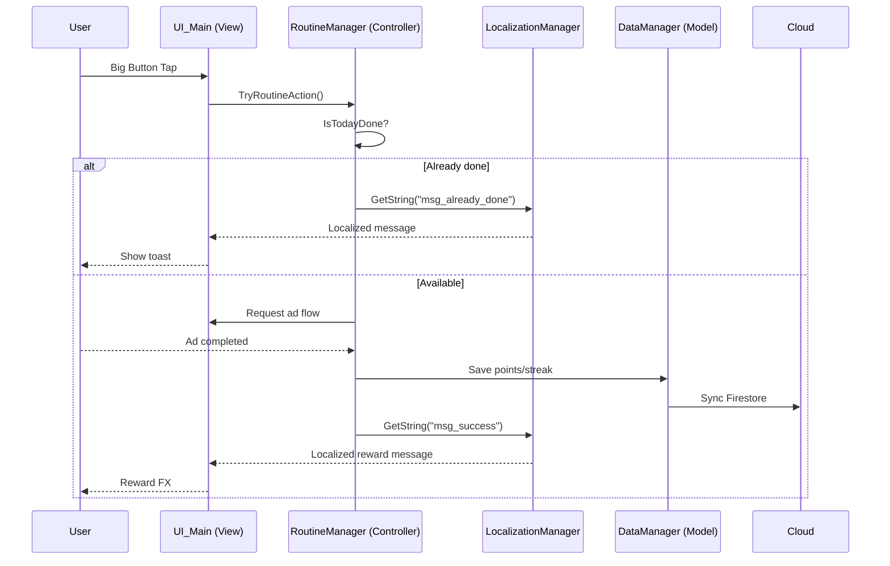

# 🏗️ System Architecture: Just One Tap

> **Pattern:** MCV (Manager-Controller-View)  
> **Updated:** 2026-02-19

---

## 1. 🔄 Core Loop (Global Standard)



---

## 2. 🧩 Runtime Components

### 2.1 Managers (Singleton)
- `GameManager`: 앱 전역 상태, 씬 전환 컨텍스트 관리.
- `RoutineManager`: 1일 1탭 루틴 규칙, streak/point 로직.
- `DataManager`: 로컬 JSON + Firestore 동기화.
- `LocalizationManager`: 언어 선택/문자열 조회.
- `AuthManager`: 로그인/로그아웃, 사용자 식별 연동.

### 2.2 Views
- `UI_Onboarding`: 온보딩 텍스트, 목표 설정.
- `UI_Main`: 상단 상태 + 중앙 버튼 + 하단 네비.
- `UI_Settings`: 언어/알림/사운드 설정.

---

## 3. 🛠️ Editor/Tooling Components

- `Assets/Editor/ProjectSetupTool.cs`
  - 프로젝트 폴더/기본 스크립트 자동 생성.
  - Player settings 자동 적용 (`Tools > J_O_T > Apply Project Settings`).
- `Assets/Editor/PackageInstaller.cs`
  - 필수 패키지 설치 요청 (`com.unity.vectorgraphics`, `com.unity.localization`).
- `figma-plugin/export-all-svg/*`
  - Figma 개발 플러그인.
  - 전 페이지/현재 페이지/선택 범위 기반으로 전체 트리를 재귀 순회해 SVG export.
  - ZIP + `_manifest.json` + `_failed.json` 생성.

---

## 4. 🎨 Figma Export Pipeline

1. Figma 플러그인 실행 (`Export All Nodes To SVG (Full Tree)`).
2. Scope 선택 (`selection` / `current-page` / `all-pages`).
3. 노드 재귀 수집 후 `exportAsync({ format: "SVG" })` 개별 수행.
4. 결과를 트리 구조대로 ZIP 패키징.
5. `_manifest.json`/`_failed.json`로 결과 정량 검증.

검증 결과(최근 실행):
- `totalTargets`: 4104
- `exportedCount`: 3302
- `failedCount`: 802
- 주요 실패 원인: 보이는 레이어가 없는 보조 노드(`Failed to export node. This node may not have any visible layers.`)

---

## 5. 💾 Data Schema

```json
{
  "uid": "user_global_001",
  "identity": {
    "nickname": "Player1",
    "country": "US",
    "language": "en"
  },
  "settings": {
    "dailyTarget": 5.0,
    "currencySymbol": "$"
  },
  "routine": {
    "currentPoints": 15.0,
    "currentStreak": 3,
    "lastActionDate": "2026-02-19"
  }
}
```
