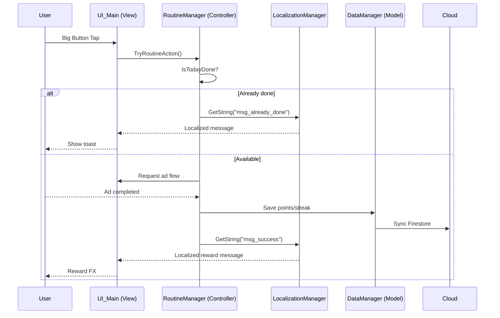

# Architecture - Just One Tap (J_O_T)

Updated: 2026-02-19 (7차, Open In Explorer 안정화 반영)

## 1) 전체 구성

1. Unity Runtime (게임 본체)
2. Figma Export Plugin (SVG + 메타 추출)
3. SVG Inspector (Unity 외부 검수 앱)
4. Unity 후속 자동배치 파이프라인(예정)

## 2) Core Loop (Runtime)



## 3) Unity Runtime (MCV)

1. Manager(Core)
   - `GameManager`: 상태 전환/라이프사이클
   - `RoutineManager`: 1일 1탭 규칙, 포인트/스트릭
   - `DataManager`: 로컬 저장 + 원격 동기화 진입점
   - `LocalizationManager`: 다국어 조회
   - `AuthManager`: 인증 상태
2. View(UI)
   - `UI_Main`, `UI_Onboarding`, `UI_Settings`
3. Controller 성격
   - UI 입력 -> Routine/Auth/Data 호출 -> 결과 렌더

## 4) Editor/Tooling

- `Assets/Editor/ProjectSetupTool.cs`
  - 폴더 구조/매니저 템플릿 자동 생성
  - Player Settings 자동 적용
- `Assets/Editor/PackageInstaller.cs`
  - 필수 패키지 설치 요청
- `figma-plugin/export-all-svg/*`
  - Figma 전체 트리 SVG 추출
  - ZIP + `_manifest.json` + `_failed.json` + `_node_layout.json`
- `svg-inspector/*`
  - Unity 반입 전 시각 검수 및 상태 기록
  - `unity-inspection-manifest.json` 생성
  - `svg-inspector-exclusions.json` 생성(검수 제외 상태)

## 5) Figma Export Plugin 파이프라인

경로: `figma-plugin/export-all-svg/`

1. Scope 선택 (`selection`, `current-page`, `all-pages`)
2. 노드 트리 순회/필터 (`includeHidden`, `includeLocked`, `onlyLeafNodes`)
3. SVG export (`<NodeName>__<NodeId>.svg`)
4. ZIP 생성
5. 메타 파일 출력
   - `_manifest.json`
   - `_failed.json`
   - `_node_layout.json`

### `_node_layout.json` 핵심 필드

1. 최상위
   - `version`, `generatedAt`, `fileName`, `scope`
2. `entries[]`
   - `nodeId`, `parentId`, `nodeName`, `nodeType`
   - `pageName`, `screenRootId`, `screenFolder`
   - `isLeaf`, `depth`, `zIndex`
   - `bbox` (`absoluteRenderBounds` 우선, fallback `absoluteBoundingBox`, 없으면 `null`)
   - `zipPath`, `relativePath`
3. `screens[]`
   - `pageName`, `screenRootId`, `screenFolder`, `bbox`

## 6) SVG Inspector 파이프라인

경로: `svg-inspector/`

1. 사용자 폴더 선택 (`showDirectoryPicker`, fallback `webkitdirectory`)
2. Screen 판정
   - 선택 루트 하위 1-depth 디렉터리
3. Root SVG 판정
   - 우선: `<screenName>__*.svg`
   - fallback: 화면 폴더 직속 첫 SVG
4. 2패널 비교 렌더
   - 좌: Root SVG
   - 우: Composited SVG
5. 검수 상태 관리
   - `pending`, `approved`, `hold` + `reviewNote`
6. 컴포넌트 선택/삭제
   - 트리 클릭/합성 클릭 공통 선택 상태 유지
   - `Exclude`/`Restore`(비파괴)
   - `Delete File`(네이티브 모드 전용, fallback 모드 비활성화)
7. Explorer 연동
   - `Open In Explorer` 버튼에서만 실행(컴포넌트 클릭 시 자동 실행 없음)
   - 기본 동작: 선택된 SVG 파일의 “포함 폴더” 오픈
   - 옵션: `Always open new Explorer window`
8. 자동 제외 프리셋
   - `deviceChrome` (`status bar`, `battery`, `wifi`, `mobile signal`, `home indicator`)
   - `keyboard`
9. 산출
   - `unity-inspection-manifest.json`
   - `svg-inspector-exclusions.json`
   - CSV (옵션)

## 7) 조합 렌더 설계 (6차 업데이트 포함)

경로: `svg-inspector/src/lib/composer.ts`

1. 입력
   - `_node_layout.json`의 `entries[]`, `screens[]`
2. 레이어 처리
   - `zIndex` 정렬 기반 합성
   - 개별 SVG를 `data:image/svg+xml;base64`로 변환 후 `<image>`로 렌더
3. 중복/오류 방지 규칙
   - `screenRootId`와 동일한 root 엔트리는 기본 제외
   - ancestor가 이미 선택되면 descendant 엔트리 가지치기
   - 가지치기 후 레이어 0건이면 root 엔트리 fallback 렌더
4. 제외/선택 규칙
   - 수동 제외(`excludedNodeIds`, `excludedPaths`) 우선 적용
   - 프리셋 제외(`deviceChrome`, `keyboard`) 병합 적용
   - `selectedNodeId`를 합성 뷰에 하이라이트
   - 사용자 제외로 0건이 된 경우 fallback 금지, 안내 메시지 표시
5. 모드 정책
   - `All`: 권장 모드
   - `Leaf`: 진단 모드

## 8) 데이터 인터페이스

### 8.1 Export -> Inspector

1. SVG 파일 트리
2. `_node_layout.json`
3. `_manifest.json`, `_failed.json` (검증용)

### 8.2 Inspector -> Unity

1. `unity-inspection-manifest.json`
2. `screens[]` 상태/메모
3. `files[]` 상대경로/노드 정보

### 8.3 Inspector Exclusions Schema

```json
{
  "version": 1,
  "generatedAt": "2026-02-19T00:00:00.000Z",
  "sourceRoot": "figma-svg-export-2026-02-19T06-14-47-384Z",
  "preset": {
    "deviceChrome": true,
    "keyboard": false
  },
  "screens": [
    {
      "screenId": "13-3321",
      "folderPath": "Page 1/Profile",
      "excludedNodeIds": ["12:500"],
      "excludedPaths": ["Page 1/Profile/Battery__12-500.svg"]
    }
  ]
}
```

### 8.4 Runtime Save Schema (Game)

```json
{
  "uid": "user_global_001",
  "identity": {
    "nickname": "Player1",
    "country": "US",
    "language": "en"
  },
  "settings": {
    "dailyTarget": 5.0,
    "currencySymbol": "$"
  },
  "routine": {
    "currentPoints": 15.0,
    "currentStreak": 3,
    "lastActionDate": "2026-02-19"
  }
}
```

### 8.5 Unity Inspection Manifest Schema

```json
{
  "version": 1,
  "generatedAt": "2026-02-19T00:00:00.000Z",
  "sourceRoot": "Page 1",
  "summary": {
    "screenTotal": 0,
    "approved": 0,
    "hold": 0,
    "pending": 0,
    "svgTotal": 0
  },
  "screens": [
    {
      "id": "13-3321",
      "name": "Profile",
      "folderPath": "Profile",
      "rootSvgPath": "Profile/Profile__13-3321.svg",
      "svgCount": 0,
      "reviewStatus": "pending",
      "reviewNote": "",
      "issues": []
    }
  ],
  "files": [
    {
      "screenId": "13-3321",
      "relativePath": "Profile/Profile__13-3321.svg",
      "nodeId": "13:3321",
      "nodeName": "Profile"
    }
  ]
}
```

## 9) 현재 결정 사항

1. 플러그인 메타 확장(`_node_layout.json`) 완료
2. Inspector 2패널 비교(루트 SVG vs 조합 SVG) 구현 완료
3. 조합 렌더 안정화(중복 가지치기 + root fallback) 반영 완료
4. 컴포넌트 선택/제외/삭제 워크플로우 구현 완료
5. 하드삭제는 네이티브 모드(`showDirectoryPicker`)에서만 허용
6. 제외 상태는 `svg-inspector-exclusions.json`으로 별도 관리
7. Explorer 연동은 수동 버튼 기반(`Open In Explorer`)으로 운영
8. Explorer는 파일 선택보다 포함 폴더 오픈을 우선 정책으로 사용
9. Unity 씬/프리팹 자동 배치 도구는 다음 단계
